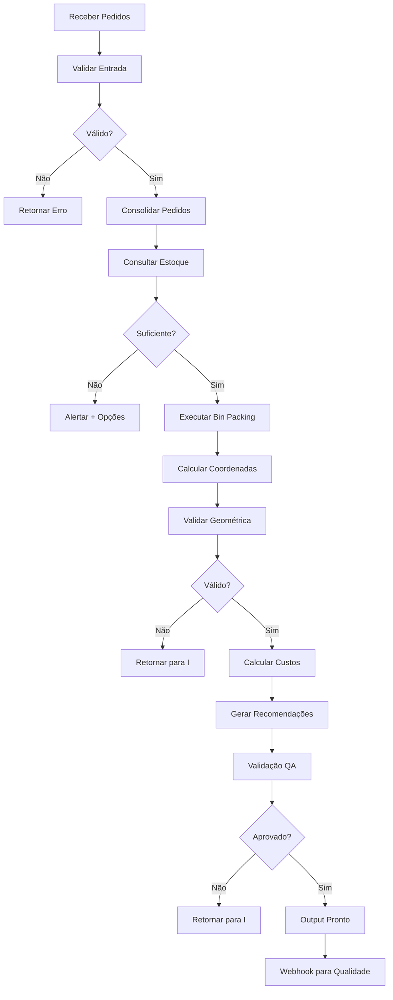

# plan-cut

Executa o workflow completo de otimização de corte para pedidos de esquadrias, gerando plano pronto para produção.

## Propósito

Receber pedidos de clientes com dimensões e especificações, otimizar o arranjo de corte para máxima eficiência de material, e retornar plano pronto para máquina de corte.

## Entrada

```yaml
pedidos:
  - id: "PED-2024-0001"
    cliente: "Cliente A"
    tipologia: "Porta Correr 2 folhas"
    dimensoes:
      altura: 2100
      largura: 1500
      quantidade: 5
    material:
      tipo: "aluminio_6063"
      tamanho_disponivel:
        altura: 6000
        largura: 400
        quantidade: 8
    restricoes:
      corte_minimo: 20
      velocidade: "media"
      tolerancia: 2

material_estoque:
  aluminio_6063: 12  # m²
  aluminio_6061: 8
  vidro: 20
```

## Saída

```yaml
plano_corte:
  id: "PLAN-2024-0001"
  versao: 1
  data_geracao: "2024-03-17T10:30:00Z"
  status: "pronto_producao"

  eficiencia:
    percentual_aproveitamento: 88
    desperdicio_m2: 1.44
    custo_por_peca: 145.50

  pecas:
    - id: "PEC-001"
      tipo: "Porta perfil inferior"
      dimensoes:
        altura: 2080
        largura: 1480
      material: "aluminio_6063"
      quantidade: 5
      coordenadas:
        x: 50
        y: 50
        rotacao: 0
      tempo_corte: 8

  relatorio:
    material_utilizado_m2: 11.2
    desperdicio_m2: 0.8
    tempo_total_min: 45
    recomendacoes:
      - "Excelente aproveitamento (88%)"
      - "Tempo dentro do previsto"
```

## Checklist

- [ ] **Validar Entrada**
  - Verificar formato de pedidos
  - Confirmar dimensões em limites técnicos
  - Validar material solicitado em estoque ou pré-compra

- [ ] **Consultar Agents**
  - Chamar `typology-manager` para validar tipologia
  - Chamar `inventory-tracker` para confirmar estoque
  - Se estoque insuficiente: Alertar e calcular com custos de compra

- [ ] **Executar Algoritmo de Corte**
  - Aplicar Bin Packing Algorithm (Guillotine)
  - Otimizar arranjo para minimizar desperdício
  - Respeitar restrições técnicas (tolerância, velocidade, clearances)

- [ ] **Calcular Eficiência**
  - Percentual_aproveitamento = (material_utilizado / material_disponível) × 100
  - Desperdício = material_disponível - material_utilizado
  - Custo_por_peca = (material_utilizado + tempo_corte) / quantidade_pecas

- [ ] **Gerar Coordenadas**
  - Calcular (x, y) para cada peça
  - Incluir ângulo de rotação ótimo
  - Validar não-overlaps

- [ ] **Validação Qualidade**
  - Chamar `quality-checker` para validar plano
  - Se rejeição: Retornar para otimização
  - Se aprovação: Marcar como "pronto_producao"

- [ ] **Gerar Output**
  - Criar arquivo de plano (JSON/XML)
  - Exportar para formato de máquina de corte
  - Armazenar versão em histórico

- [ ] **Notificar Integrações**
  - Webhook POST para squad-qualidade
  - Atualizar status em dashboard
  - Alertar se desperdício > limite

## Subtarefas

### 1. Consolidação de Pedidos (5 min)

Agrupar pedidos compatíveis para maximizar eficiência:
- Mesmo material → combinar
- Tipologia similar → analisar viabilidade
- Prazos próximos → agrupar se possível

**Saída esperada:** Lista consolidada de lotes de corte

### 2. Otimização 2D (15 min)

Executar algoritmo de bin packing:
- Entrada: Lotes consolidados + material disponível
- Algoritmo: Maximal Rectangles ou Guillotine
- Objetivo: Maximizar eficiência (meta: ≥85%)
- Restrição: Respeitar tolerâncias e velocidades

**Saída esperada:** Arranjo otimizado com coordenadas

### 3. Validação Geométrica (5 min)

Verificar integridade do plano:
- [ ] Sem overlaps de peças
- [ ] Distâncias mínimas entre cortes (clearances)
- [ ] Rotações dentro de limites
- [ ] Todas as peças dentro do material

**Saída esperada:** Plano validado (sem erros)

### 4. Cálculo de Custos e Tempo (5 min)

Computar métricas finais:
- Tempo total de corte
- Custo material
- Custo processamento
- Margem de lucro

**Saída esperada:** Detalhamento de custos

### 5. Recomendações Automáticas (3 min)

Gerar insights para otimização futura:
- Se eficiência < 80%: Sugerir consolidação
- Se tempo > limite: Sugerir parallelização
- Se desperdício alto: Alertar compras

**Saída esperada:** Lista de recomendações

## Métricas de Sucesso

| Métrica | Target | Aceitável |
|---------|--------|-----------|
| Eficiência de corte | ≥ 88% | ≥ 80% |
| Tempo de otimização | < 5 min | < 10 min |
| Taxa de erro | 0% | < 1% |
| Taxa rejeição QA | 0% | < 5% |

## Error Handling

**Se material insuficiente:**
```
Status: PENDENTE_VALIDACAO
Ação: Notificar squad-estoque
Opções: Aguardar reposição / Usar substituto / Dividir pedido
```

**Se dimensões inválidas:**
```
Status: ERRO_VALIDACAO
Ação: Retornar ao squad-crm
Mensagem: "Dimensões não conformes à tipologia"
```

**Se eficiência muito baixa:**
```
Status: COM_RESTRICOES
Ação: Sugerir consolidação com próximo pedido
Recomendação: "Agrupar com pedido PED-2024-0002"
```

## Workflow Detalhado



## Integração com Outros Squads

| Squad | Função |
|-------|--------|
| squad-producao | Corte-optimizer executa |
| squad-qualidade | Valida plano |
| squad-estoque | Consulta disponibilidade |
| squad-crm | Origem dos pedidos |
| squad-dashboard | Monitora em tempo real |

## Exemplo de Execução

**Input:**
```json
{
  "pedidos": [
    {
      "id": "PED-001",
      "tipologia": "Porta Correr",
      "dimensoes": {"altura": 2100, "largura": 1500},
      "quantidade": 5
    }
  ],
  "material": {"aluminio_6063": 12}
}
```

**Output:**
```json
{
  "plano_id": "PLAN-001",
  "eficiencia": 88,
  "pecas": [...],
  "status": "pronto_producao",
  "tempo_minutos": 45
}
```

## Próximos Passos

1. ✅ Gerar plano de corte
2. → Validação pelo squad-qualidade
3. → Geração de relatório (task: generate-production-report)
4. → Envio para máquina de corte

---

*Task: Gerar plano de corte otimizado — Core da produção especializada*
